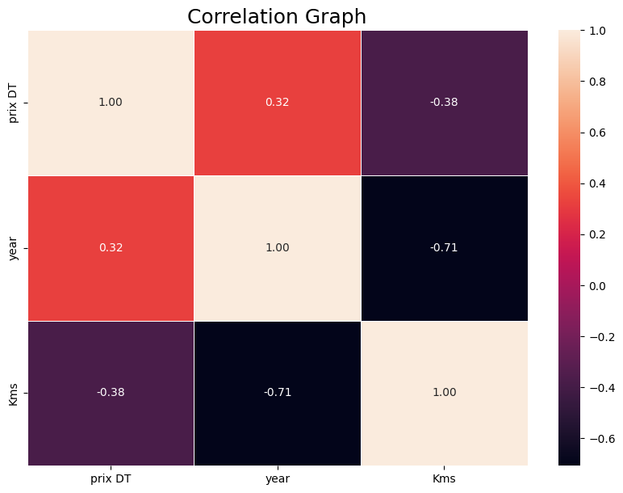
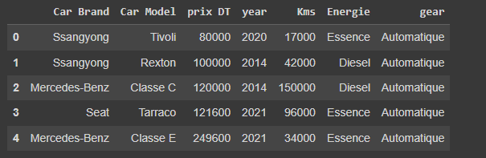
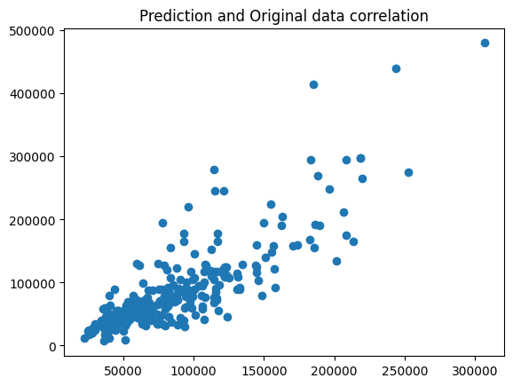

# Car Price Prediction

This project demonstrates a complete workflow for training and evaluating a car price prediction model using a RandomForestRegressor with scikit-learn.

## Overview

The goal of this project is to predict car prices based on various features such as car brand, model, year, kilometers driven, fuel type, and gear type.

## Dataset

The dataset used in this project contains information about cars and their prices. The key features include:
- Car Brand
- Car Model
- Year
- Kilometers Driven
- Fuel Type
- Gear Type
- Price (in DT)

## Data Visualization

### Correlation Graph

### Sample of Dataset

### Prediction and Original Data Correlation

